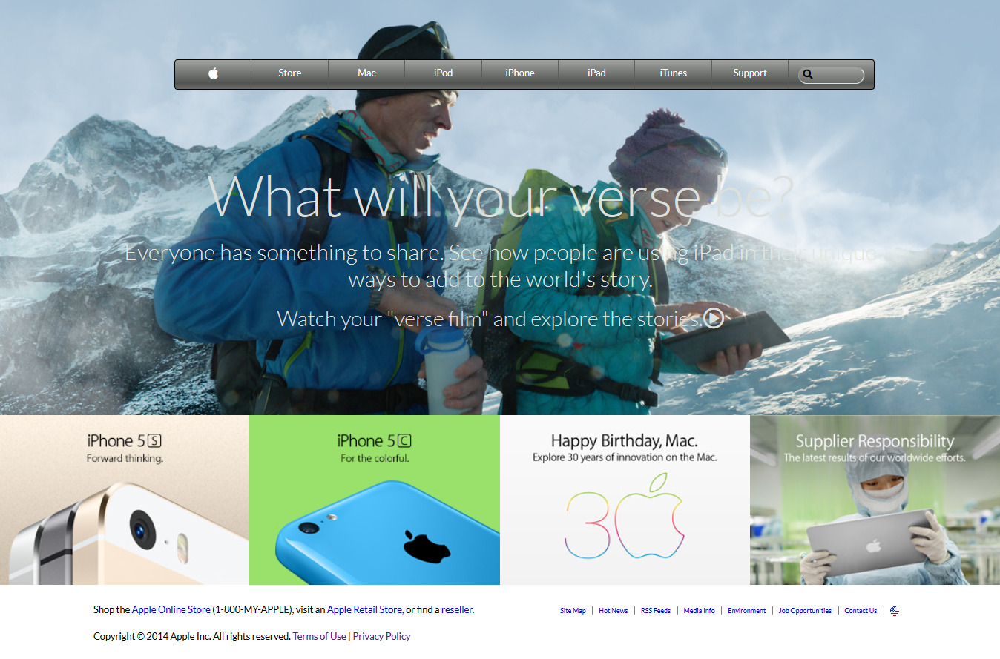

# Apple_old_website_clone / Background and Gradients

This project is the clone version of apple old-version website. In this process I used some awesome features of background and gradient which makes my website attractive.

# Original Design

Original Design link : [apple.com](https://web.archive.org/web/20140301004610/http://www.apple.com/)

# Live Link

[Live-link](https://raw.githack.com/Dipeshtwis/apple_clone/feature-apple/index.html)

# Project Design

Project Design Screenshot : 

# Github link:

For the: [Github-link](https://github.com/Dipeshtwis/apple_clone/tree/feature-apple)

# Project flow

## Background image section

- Set the background image

## Header section

- Used flex box for heading
- Used gradient to make attractive

## Grid image section

- Used grid for division and set background image

## Footer section

- Used flex box

# Technology Used

- HTML
- CSS
- Font Awesome icons

# Authors

👤 **Dipesh Kumar**

- Github: [@Dipeshtwis](https://github.com/Dipeshtwis)
- Twitter: [@97deepeshkumar](https://twitter.com/97deepeshkumar)
- Linkedin: [dipeshtwis](https://www.linkedin.com/in/dipeshtwis/)

## 👍 Show your support

Give a ⭐️ if you like this project!

## :clap: Acknowledgements

- Microverse: [@microverse](https://www.microverse.org/)
